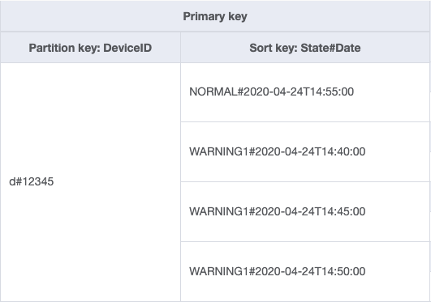
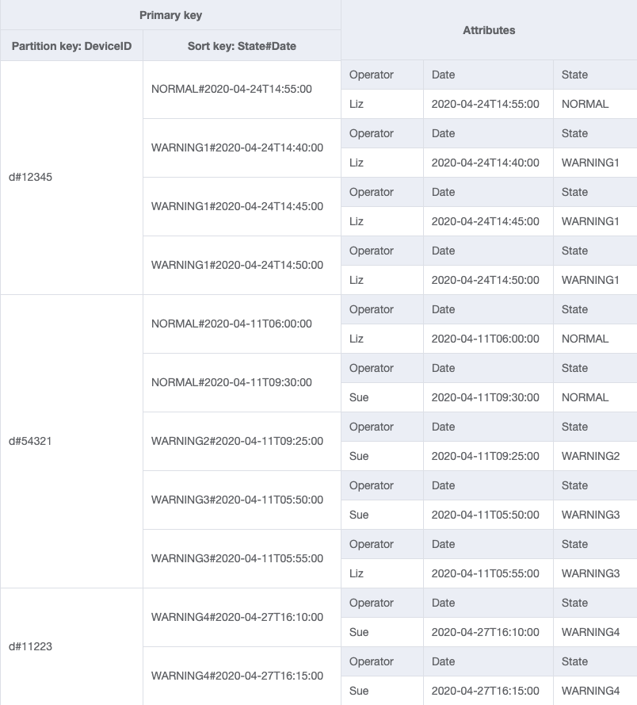
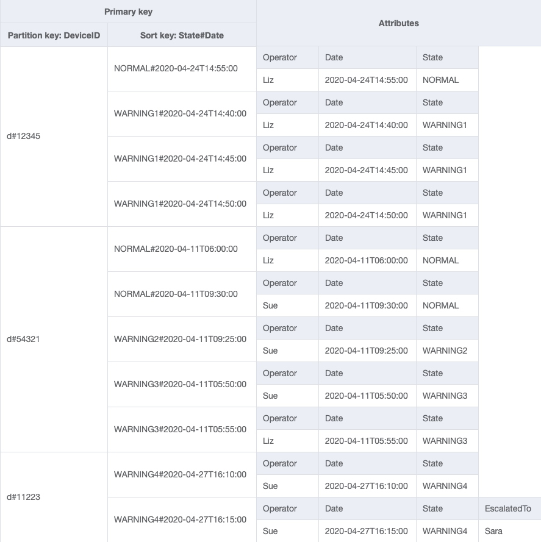

# Device State Log

This example covers:
- how to use composite sort key instead of filter expression
- how global secondary index makes it possible to create a new item collection from the existing items in a table
- how indexes are sparse by default


[NoSQL Workbench for Amazon DynamoDB](https://docs.aws.amazon.com/amazondynamodb/latest/developerguide/workbench.settingup.html) is a great tool for designing and visualizing data models for Amazon DynamoDB applications. There are several data models in `json` format for each step of this example that can be imported in NoSQL Workbench. 

A bit of context on what this example is about:

- In a factory, there are many **devices** that are monitored by human **operators**. 
- When there is a problem or abnormal behavior of a device, a message will be sent to the monitoring system indicating that the device state has changed from normal to warning.
- There are different warning levels depending on the severity and type of abnormal behavior of the device. 
- The message will be sent every five minutes until the device state is back to normal.   
- The system will assign an operator to check the device. 
- An operator may escalate the problem to his/her **supervisor**.

## Composite Sort Key

In NoSQL Workbench, import [DeviceStateLog_1.json](json/DeviceStateLog_1.json) to create `DeviceStateLog` table with example data. 
<br>
<br>
*Table*
<br>

<br>


Let's look into how to handle the first access pattern for this example:

| Access Pattern |Table/GSI/LSI|Key Condition|Filter Expression | Sort | Example |
| :---        | :---         | :---     | :---    |:---|:---|
| Get all logs for a specific device state showing the most recent logs first |Table|DeviceID=deviceId | State=state | Descending | DeviceID="d#12345", State="WARNING1" |

Import [DeviceStateLog_2.json](json/DeviceStateLog_2.json) where `Detail` attribute was added to the table.

The following AWS CLI example queries the `DeviceStateLog` table to retrieve all the logs that have `WARNING1` state for a device with `DeviceID = "d#12345"` and the most recent logs shown first. The statement `no-scan-index-forward` changes the default sort order from ascending to descending.

```
aws dynamodb query \
  --table-name DeviceStateLog \
  --key-condition-expression "#dID = :dID" \
  --no-scan-index-forward \
  --filter-expression "#s = :s" \
  --expression-attribute-names '{"#dID":"DeviceID","#s":"State"}' \
  --expression-attribute-values '{":dID":{"S":"d#12345"},":s":{"S":"WARNING1"}}' \
  --return-consumed-capacity TOTAL
```
After running the query, apart from the actual returned items the output also contains this information:

```
"Count": 3,
"ScannedCount": 4,
"ConsumedCapacity": {
    "TableName": "DeviceStateLog",
    "CapacityUnits": 1.5
}
```

[ScannedCount](https://docs.aws.amazon.com/amazondynamodb/latest/APIReference/API_Query.html#DDB-Query-response-ScannedCount) refers to all the logs that are found for this specific device **before** filter expression was applied.

[Count](https://docs.aws.amazon.com/amazondynamodb/latest/APIReference/API_Query.html#DDB-Query-response-Count) refers to the final number of items that are returned **after** filter expression was applied.

Note that [ConsumedCapacity](https://docs.aws.amazon.com/amazondynamodb/latest/APIReference/API_Query.html#DDB-Query-response-ConsumedCapacity) is calculated based on **ScannedCount**.

For comparison, run the query below where the filter has been removed and observe the result:

```
aws dynamodb query \
  --table-name DeviceStateLog \
  --key-condition-expression "#dID = :dID" \
  --no-scan-index-forward \
  --expression-attribute-names '{"#dID":"DeviceID"}' \
  --expression-attribute-values '{":dID":{"S":"d#12345"}}' \
  --return-consumed-capacity TOTAL
```
```
"Count": 4,
"ScannedCount": 4,
"ConsumedCapacity": {
    "TableName": "DeviceStateLog",
    "CapacityUnits": 1.5
}    
```
Let's see if there is another way to handle this access pattern.

Import [DeviceStateLog_3.json](json/DeviceStateLog_3.json) where the sort key is changed to `State#Date` which is the composition of the attributes **State + \# + Date**. In this example, \# is used as a delimiter.
<br>
<br>
*Table*
<br>

<br>

| Access Pattern |Table/GSI/LSI|Key Condition|Filter Expression | Sort | Example |
| :---        | :---         | :---     | :---    |:---|:---|
| Get all logs for a specific device state showing the most recent logs first |Table|DeviceID=deviceId and State#Date **begins_with** "**state1#**"| - | Descending | DeviceID="d#12345" and State#Date begins_with "WARNING1#" |

In the following AWS CLI example, [begins_with()](https://docs.aws.amazon.com/amazondynamodb/latest/developerguide/Query.html#Query.KeyConditionExpressions) operator is used to retrieve only the logs that have the `WARNING1` state for the desired device. 

```
aws dynamodb query \
  --table-name DeviceStateLog \
  --no-scan-index-forward \
  --key-condition-expression "#dID = :dID AND begins_with(#s, :sd)" \
  --expression-attribute-names '{"#dID":"DeviceID","#s":"State#Date"}' \
  --expression-attribute-values '{":dID":{"S":"d#12345"},":sd":{"S":"WARNING1#"}}' \
  --return-consumed-capacity TOTAL
```

Notice that `Count` and `ScannedCount` has the same value and that `ConsumedCapacity` has decreased as well.

```
"Count": 3,
"ScannedCount": 3,
"ConsumedCapacity": {
    "TableName": "DeviceStateLog",
    "CapacityUnits": 0.5
}
```

Filter expression can be a good way to exclude items that are queried if the ratio of excluded items is low or the query is performed infrequently. For cases where many items are retrieved from a table and the majority of the items are filtered out, there could be a more efficient way to design the table. 

## Create a New Item Collection with Global Secondary Index

In NoSQL Workbench, import [DeviceStateLog_4.json](json/DeviceStateLog_4.json) where `Operator` attribute was added to the `DeviceStateLog` table with example data.
<br>
<br>
*Table*
<br>
<br>
<br>
The next access pattern is:<br>
**Get all device logs for a given operator between two dates**<br>
<br>
Item collection refers to item(s) that have the same partition key. So far, this table contains item collections for devices. In order to handle this new access pattern, create a new item collection where `Operator` is the partition key and `Date` is the sort key in a global secondary index (GSI). [Between](https://docs.aws.amazon.com/amazondynamodb/latest/developerguide/Query.html#Query.KeyConditionExpressions) operator retrieves only the logs that are in the desired date range. Import [DeviceStateLog_5.json](json/DeviceStateLog_5.json).
<br>
<br>
*GSI1*
<br>

<br>
| Access Pattern |Table/GSI/LSI|Key Condition|Filter Expression | Sort | Example |
| :---        | :---         | :---     | :---    |:---|:---|
| Get all device logs for a given operator between two dates | GSI1 |Operator = operatorName and Date **between** date1 **and** date2  | - | Ascending | Operator="Liz" and Date between "2020-04-20" and "2020-04-25" |

Here is an AWS CLI example for this access pattern:

```
aws dynamodb query \
  --table-name DeviceStateLog \
  --index-name GSI1 \
  --key-condition-expression "#op = :op AND #d  between :d1 AND :d2" \
  --expression-attribute-names '{"#op": "Operator" , "#d": "Date"}' \
  --expression-attribute-values '{":op": {"S":"Liz"} , ":d1": {"S":"2020-04-20"}, ":d2":{"S":"2020-04-25"}}' \
  --return-consumed-capacity TOTAL
```

## Sparse Index

Global secondary indexes are sparse by default, so only items in the base table that contain primary key attributes of the index will actually appear in the index. This is another way of excluding items that are not relevant for the access pattern being modeled.

The last access patterns relates to:<br>
**Get all escalated device logs for a given supervisor**

Import [DeviceStateLog_6.json](json/DeviceStateLog_6.json) where `EscalatedTo` attribute was added to the `DeviceStateLog` table with example data. As mentioned earlier, not all of the logs gets escalated to a supervisor.
<br>
<br>
*Table*
<br>

<br>
<br>
Import [DeviceStateLog_7.json](json/DeviceStateLog_7.json) to create a new global secondary index (GSI) where `EscalatedTo` is the partition key and `State#Date` is the sort key. Notice that only items that have both `EscalatedTo` and `State#Date` attributes appear in the index.
<br>
<br>
*GSI2*
<br>

<br>
<br>
| Access Pattern |Table/GSI/LSI|Key Condition|Filter Expression | Sort | Example |
| :---        | :---         | :---     | :---    |:---|:---|
| Get all escalated logs for a given supervisor | GSI2 |EscalatedTo=supervisorName | - | Ascending | EscalatedTo="Sara" |
| Get all escalated logs with a specific device state for a given supervisor | GSI2 |EscalatedTo = supervisorName and State#Date **begins_with** "**state1#**"| - | Ascending | EscalatedTo="Sara" and State#Date **begins_with** "**WARNING4#**"|
| Get all escalated logs with a specific device state for a given supervisor for a specific date | GSI2 |EscalatedTo = supervisorName and State#Date **begins_with** "**state1#date1**"| - | Ascending | EscalatedTo="Sara" and State#Date **begins_with** "**WARNING4#2020-04-27**" |
<br>
Here is an AWS CLI example for these access patterns:

```
aws dynamodb query \
  --table-name DeviceStateLog \
  --index-name GSI2 \
  --key-condition-expression "#su = :su" \
  --expression-attribute-names '{"#su":"EscalatedTo"}' \
  --expression-attribute-values '{":su":{"S":"Sara"}}' \
  --return-consumed-capacity TOTAL
```

```
aws dynamodb query \
  --table-name DeviceStateLog \
  --index-name GSI2 \
  --key-condition-expression "#su = :su AND begins_with(#s, :sd)" \
  --expression-attribute-names '{"#su":"EscalatedTo","#s":"State#Date"}' \
  --expression-attribute-values '{":su":{"S":"Sara"},":sd":{"S":"WARNING4#"}}' \
  --return-consumed-capacity TOTAL
```

```
aws dynamodb query \
  --table-name DeviceStateLog \
  --index-name GSI2 \
  --key-condition-expression "#su = :su AND begins_with(#s, :sd)" \
  --expression-attribute-names '{"#su":"EscalatedTo","#s":"State#Date"}' \
  --expression-attribute-values '{":su":{"S":"Sara"},":sd":{"S":"WARNING4#2020-04-27"}}' \
  --return-consumed-capacity TOTAL
```

## Final Words

Congratulations! You made it to the end.
<br>
Please keep in mind that the intention of this example is not to design a complete realistic device state management but rather show a few NoSQL design patterns. Always make sure to start defining your access patterns first and then build your model.  
