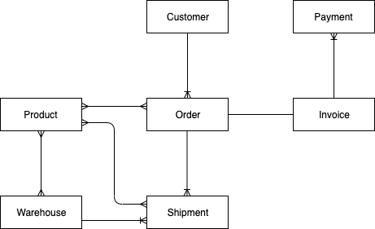
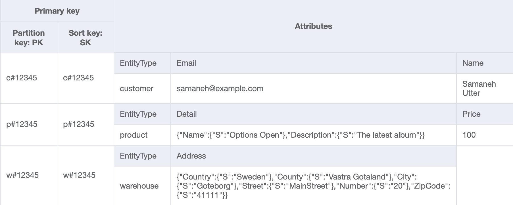
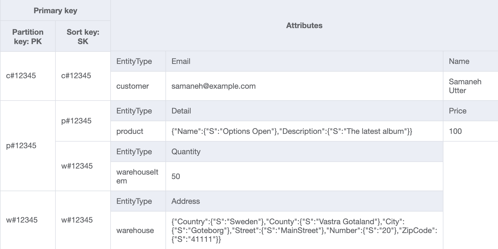
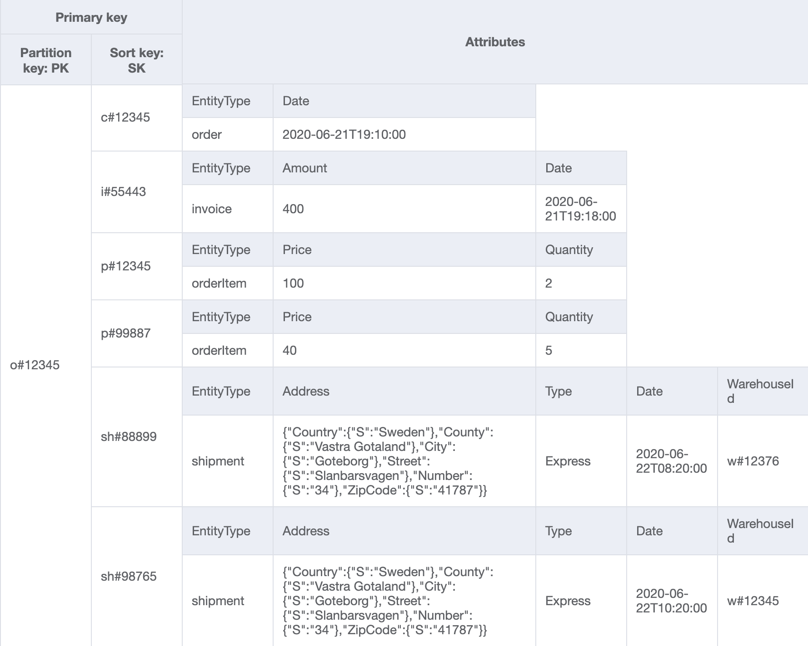
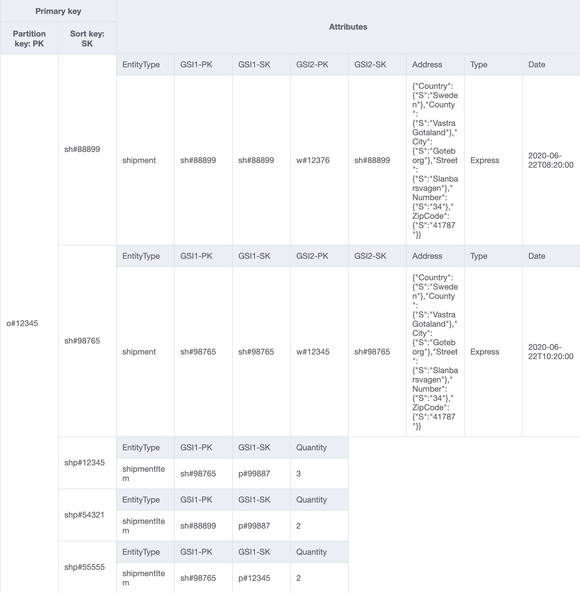
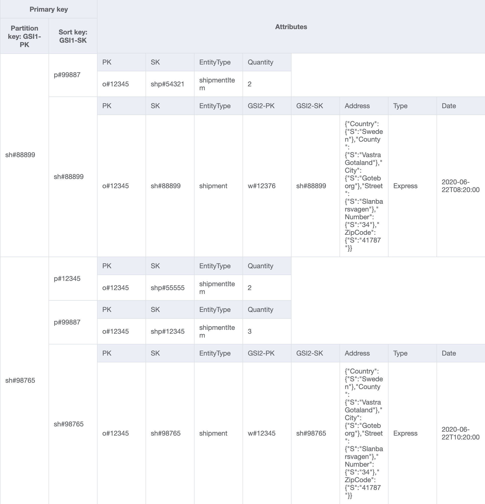
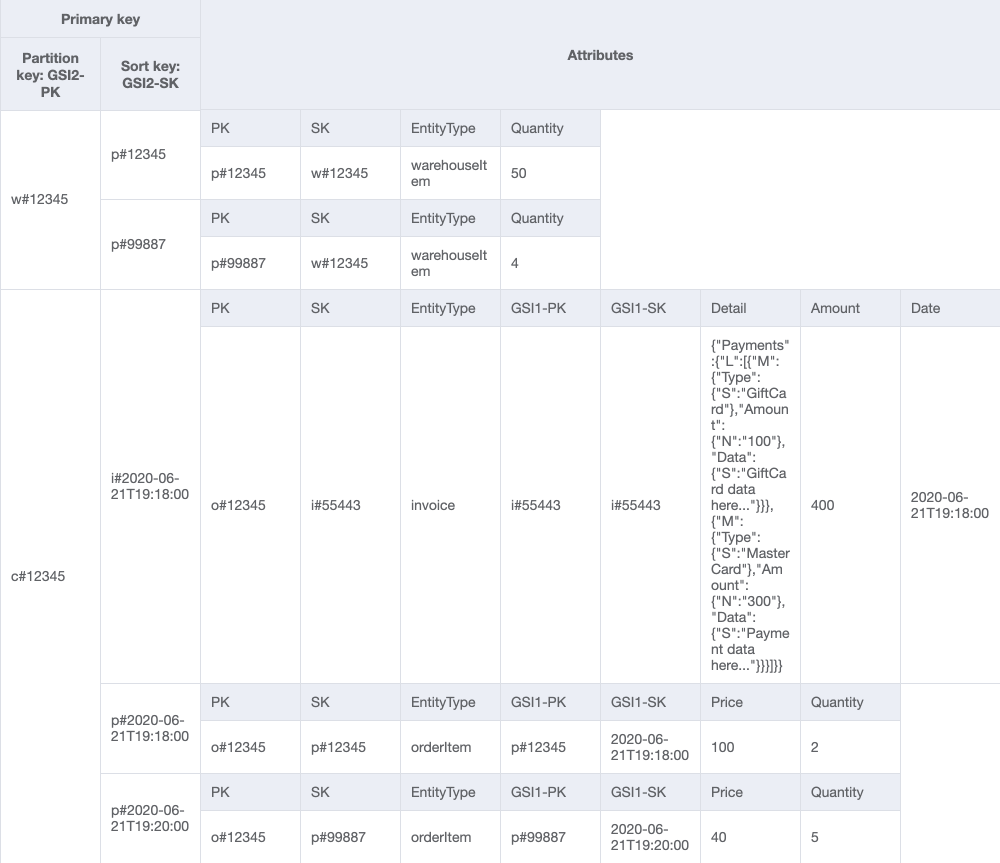

# Online Shop

In this use case, some thoughts and patterns are explained that can be helpful for several NoSQL data modeling scenarios. [NoSQL Workbench for Amazon DynamoDB](https://docs.aws.amazon.com/amazondynamodb/latest/developerguide/workbench.settingup.html) is used since it is a great tool for designing and visualizing data models for Amazon DynamoDB applications.

## Use Case

...
 
 A **customer** visits an online shop, browses through different **products** and places an **order** for some of the **products**. Based on the **invoice**, customer can pay using discount code or gift card and pay for the remaining amount by credit card. Purchased products will be picked from one or several **warehouses** and will be **shipped** to the provided address.
 
 ...

## Entity Relation Diagram

The existence of Customer, Product and Warehouse entities is independent of any other entity while Invoice and Shipment entities depend on Order entity. When going through each access pattern, the type of entity has an effect on how an item collection is built. Item collection refers to item(s) that have the same partition key.

In order to model the 1:M and M:N relations between entities in this scenario, composite primary key (partition key + sort key) is chosen for this table over simple primary key (partition key). Note that not all the items in the table models a relationship, there are items that represents the entity itself. These items will have the same value for both partition and sort keys.

## Access Patterns

Always start from the data access patterns of the application when designing the data model.

| Access Patterns      |
| :---        | 
| Get customer for a given customerId      | 
| Get product for a given productId   | 
| Get warehouse for a given warehouseId |
| Get a product inventory for all warehouses by a productId |
| Get order for a given orderId |
| Get all products for a given orderId |
| Get invoice for a given orderId |
| Get all shipments for a given orderId |
| Get all orders for a given productId for a given date range |
| Get invoice for a given invoiceId |
| Get all payments for a given invoiceId |
| Get shipment detail for a given shipmentId |
| Get all shipments for a given warehouseId |
| Get inventory of all products for a given warehouseId |
| Get all invoices for a given customerId for a given date range |
| Get all products ordered by a given customerId for a given date range  |

## Data Modeling with NoSQL Workbench

The above access patterns are modeled one by one. There is a data model in `json` format that can be imported in NoSQL Workbench for each step, in order to gradually build up a complete model. Please check the `/json` folder.

### Step 1

Import [AnOnlineShop_1.json](json/AnOnlineShop_1.json) to create a new data model in NoSQL Workbench called `AnOnlineShop` as well as a new table called `OnlineShop`.
Note that the generic names PK and SK are chosen for partition and sort key respectively, this is a practice used in order to store different types of entities in the same table.

### Step 2

Import [AnOnlineShop_2.json](json/AnOnlineShop_2.json) to handle the below access pattern:

| Access Patterns |Table/GSI/LSI|Key Condition|Filter Expression| Example|
| :---        | :---         | :---     | :---    |:---|
|Get customer for a given customerId|Table|PK=customerId and SK=customerId|-|PK="c#12345" and SK="c#12345"|

As mentioned earlier, some entities does not have any relationships to other entities, thus PK and SK have the same value. In the example data, note that the keys use a prefix `c#` in order to distinguish the customerId from other entities that will be added later. This practice is repeated for other entities as well.

### Step 3

Import [AnOnlineShop_3.json](json/AnOnlineShop_3.json) to respond to the following access pattern about the Product entity:

| Access Patterns |Table/GSI/LSI|Key Condition|Filter Expression| Example|
| :---        | :---         | :---     | :---    |:---|
|Get product for a given productId|Table|PK=productId and SK=productId|-|PK="p#12345" and SK="p#12345"|

### Step 4

To handle the following access pattern for the Warehouse entity, import [AnOnlineShop_4.json](json/AnOnlineShop_4.json):

| Access Patterns |Table/GSI/LSI|Key Condition|Filter Expression| Example|
| :---        | :---         | :---     | :---    |:---|
|Get warehouse for a given warehouseId|Table|PK=warehouseId and SK=warehouseId|-|PK="w#12345" and SK="w#12345"|

So far, Customer, Product and Warehouse entities are added to the table:
 
 
*Table*
 

### Step 5

Let's continue by importing [AnOnlineShop_5.json](json/AnOnlineShop_5.json):

| Access Patterns |Table/GSI/LSI|Key Condition|Filter Expression| Example|
| :---        | :---         | :---     | :---    |:---|
|Get a product inventory for all warehouses by a productId|Table|PK=productId and SK **begins_with** "**w#**"|-|PK="p#12345" and SK begins_with "w#"|

WarehouseItem entity is used to keep track of number of Products in each Warehouse. This item would normally be updated when a product is added or removed from a warehouse. 
As can be seen in the ERD, there is a M:N relationship between Product and Warehouse. Here, the 1:M relationship from Product to Warehouse is modeled as WarehouseItem. Later on, the 1:M relationship from Warehouse to Product will be modeled as well.

Read more about begins_with() and other expressions that can be applied to sort keys: [Key Condition Expressions](https://docs.aws.amazon.com/amazondynamodb/latest/developerguide/Query.html#Query.KeyConditionExpressions)
 
 
*Table*
 

### Step 6

Let's populate the table with some more Customer, Product and Warehouse items by importing [AnOnlineShop_6.json](json/AnOnlineShop_6.json).

### Step 7

Import [AnOnlineShop_7.json](json/AnOnlineShop_7.json) to build an item collection for Order that can respond to the following access patterns:

| Access Patterns |Table/GSI/LSI|Key Condition|Filter Expression| Example|
| :---        | :---         | :---     | :---    |:---|
|Get all order details for a given orderId|Table|PK=orderId|-|PK="o#12345"|
|Get all products for a given orderId|Table|PK=orderId and SK **begins_with** "**p#**"|-|PK="o#12345" and SK begins_with "p#"|

Below, the 1:M relationship between Order and Product is modeled as OrderItem entities.
 
 
*Table*
 
  
 
### Step 8

Import [AnOnlineShop_8.json](json/AnOnlineShop_8.json) to add an Invoice entity to the Order item collection to handle this access pattern:

| Access Patterns |Table/GSI/LSI|Key Condition|Filter Expression| Example|
| :---        | :---         | :---     | :---    |:---|
|Get invoice for a given orderId|Table|PK=orderId and SK **begins_with** "**i#**"|-|PK="o#12345" and SK begins_with "i#"|

 

*Table*
 

### Step 9

Import [AnOnlineShop_9.json](json/AnOnlineShop_9.json) to add Shipment entities to Order item collection:

| Access Patterns |Table/GSI/LSI|Key Condition|Filter Expression| Example|
| :---        | :---         | :---     | :---    |:---|
|Get all shipments for a given orderId|Table|PK=orderId and SK **begins_with** "**sh#**"|-|PK="o#12345" and SK begins_with "sh#"|

Notice how the Order item collection contains the different relations that an Order entity has with Shipment, OrderItem and Invoice entities.
 
 
*Table*
 

## Step 10

In the previous steps, an item collection for Order was created. Import [AnOnlineShop_10.json](json/AnOnlineShop_10.json) to create a new item collection that makes it possible to retrieve OrderItem data from several Order item collections. The first global secondary index (GSI) is created for this reason. 

In the table, items which contain attributes that are set as primary keys for the GSI, will automatically be populated in the GSI via Amazon DynamoDB. There is no need to manually do any additional inserts to the GSI.

| Access Patterns |Table/GSI/LSI|Key Condition|Filter Expression| Example|
| :---        | :---         | :---     | :---    |:---|
|Get all orders for a given productId for a given date range|GSI1|PK=productId and SK **between** date1 **and** date2|-|PK="p#99887" and SK between "2020-06-21T00:00:00" and "2020-06-21T23:59:00"|
 

*Table*
 

 
 
*GSI1*
 

### Step 11

Import [AnOnlineShop_11.json](json/AnOnlineShop_11.json) to handle the following access patterns related to Invoice. As can be seen, even though there are two different access patterns, they are realized using the same key condition. Payments are defined as an attribute with Map data type on the Invoice entity.

| Access Patterns |Table/GSI/LSI|Key Condition|Filter Expression| Example|
| :---        | :---         | :---     | :---    |:---|
|Get invoice for a given invoiceId|GSI1|PK=invoiceId and SK=invoiceId|-|PK="i#55443" and SK="i#55443"|
|Get all payments for a given invoiceId|GSI1|PK=invoiceId and SK=invoiceId|-|PK="i#55443" and SK="i#55443"|
 

*GSI1*
 

### Step 12

Import [AnOnlineShop_12.json](json/AnOnlineShop_12.json) to handle the following access patterns. 

| Access Patterns |Table/GSI/LSI|Key Condition|Filter Expression| Example|
| :---        | :---         | :---     | :---    |:---|
|Get shipment detail for a given shipmentId|GSI1|PK=shipmentId |-|PK="sh#98765" |

Notice that ShipmentItem entities are added to the Order item collection in order to be able to retrieve all details about an Order in a single query operation. As GSI1 partition and sort keys are already used to model 1:M relation between Shipment and ShipmentItem in Order item collection, GSI2 needs to be created to model the 1:M relationship between Warehouse and Shipment.
 
 
*Table*
 

 
 
*GSI1*
 

 

| Access Patterns |Table/GSI/LSI|Key Condition|Filter Expression| Example|
| :---        | :---         | :---     | :---    |:---|
|Get all shipments for a given warehouseId|GSI2|PK=warehouseId and SK **begins_with** "**sh#**"|-|PK="w#12345" and SK begins_with "sh#"|
 

*GSI2*
 

### Step 13

Import [AnOnlineShop_13.json](json/AnOnlineShop_13.json) to model the final access patterns:

| Access Patterns |Table/GSI/LSI|Key Condition|Filter Expression| Example|
| :---        | :---         | :---     | :---    |:---|
|Get inventory of all products for a given warehouseId|GSI2|PK=warehouseId and SK **begins_with** "**p#**"|-|PK="w#12345" and SK begins_with "p#"|
|Get all invoices for a given customerId for a given date range|GSI2|PK=customerId and SK **between** i#date1 **and** i#date2|-|PK="c#12345" and SK between "i#2020-06-01" and "i#2020-06-15"|
|Get all products ordered by a given customerId for a given date range|GSI2|PK=customerId and SK **between** p#date1 **and** p#date2|-|PK="c#12345" and SK between "p#2020-06-01" and "p#2020-06-15"|
 

*GSI2*
 

### Step 14

Import [AnOnlineShop_facets.json](json/AnOnlineShop_facets.json) to see the [facets](https://docs.aws.amazon.com/amazondynamodb/latest/developerguide/workbench.Visualizer.Facets.html) for the different access patterns of this use case.

### Step 15

Now that all access patterns are covered, it is time to review the completed model. Are there any access patterns that need to be modeled in a different way? 

| Access Patterns |Table/GSI/LSI|Key Condition|Filter Expression| Example|
| :---        | :---         | :---     | :---    |:---|
|Get customer for a given customerId|Table|PK=customerId and SK=customerId|-|PK="c#12345" and SK="c#12345"|
|Get product for a given productId|Table|PK=productId and SK=productId|-|PK="p#12345" and SK="p#12345"|
|Get warehouse for a given warehouseId|Table|PK=warehouseId and SK=warehouseId|-|PK="w#12345" and SK="w#12345"|
|Get a product inventory for all warehouses by a productId|Table|PK=productId and SK **begins_with** "**w#**"|-|PK="p#12345" and SK begins_with "w#"|
|Get all order details for a given orderId|Table|PK=orderId|-|PK="o#12345"|
|Get all products for a given orderId|Table|PK=orderId and SK **begins_with** "**p#**"|-|PK="o#12345" and SK begins_with "p#"|
|Get invoice for a given orderId|Table|PK=orderId and SK **begins_with** "**i#**"|-|PK="o#12345" and SK begins_with "i#"|
|Get all shipments for a given orderId|Table|PK=orderId and SK **begins_with** "**sh#**"|-|PK="o#12345" and SK begins_with "sh#"|
|Get all orders for a given productId for a given date range|GSI1|PK=productId and SK **between** date1 **and** date2|-|PK="p#99887" and SK between "2020-06-21T00:00:00" and "2020-06-21T23:59:00"|
|Get invoice for a given invoiceId|GSI1|PK=invoiceId and SK=invoiceId|-|PK="i#55443" and SK="i#55443"|
|Get all payments for a given invoiceId|GSI1|PK=invoiceId and SK=invoiceId|-|PK="i#55443" and SK="i#55443"|
|Get shipment detail for a given shipmentId|GSI1|PK=shipmentId |-|PK="sh#98765" |
|Get all shipments for a given warehouseId|GSI2|PK=warehouseId and SK **begins_with** "**sh#**"|-|PK="w#12345" and SK begins_with "sh#"|
|Get inventory of all products for a given warehouseId|GSI2|PK=warehouseId and SK **begins_with** "**p#**"|-|PK="w#12345" and SK begins_with "p#"|
|Get all invoices for a given customerId for a given date range|GSI2|PK=customerId and SK **between** i#date1 **and** i#date2|-|PK="c#12345" and SK between "i#2020-06-01" and "i#2020-06-15"|
|Get all products ordered by a given customerId for a given date range|GSI2|PK=customerId and SK **between** p#date1 **and** p#date2|-|PK="c#12345" and SK between "p#2020-06-01" and "p#2020-06-15"|

## Step 16

When working on a real use case, involve the key stakeholders in the review iterations to verify whether the requirement for the use case is covered by all the access patterns. Here, all the access patterns are fulfilled but there is a limitation in case a future demand would be, *'to get all customer activities during a date range'*. The data model can be tweaked as below:

| Access Patterns |Table/GSI/LSI|Key Condition|Filter Expression| Example|
| :---        | :---         | :---     | :---    |:---|
|Get all invoices for a given customerId for a given date range|GSI2|PK=customerId and SK **between** date1 **and** date2|EntityType="invoice"|PK="c#12345" and SK between "2020-06-01" and "2020-06-15"|
|Get all products ordered by a given customerId for a given date range|GSI2|PK=customerId and SK **between** date1 **and** date2|EntityType="orderItem"|PK="c#12345" and SK between "2020-06-01" and "2020-06-15"|

Import [AnOnlineShop_14.json](json/AnOnlineShop_14.json) to check the revised data model. Notice that the prefix from the date string is removed and filter expression is used instead. The new access pattern is handled as below:

| Access Patterns |Table/GSI/LSI|Key Condition|Filter Expression| Example|
| :---        | :---         | :---     | :---    |:---|
|Get all products ordered and also invoices for a given customerId for a given date range|GSI2|PK=customerId and SK **between** date1 **and** date2|-|PK="c#12345" and SK between "2020-06-01" and "2020-06-15"|

## Step 17

Congratulations! You made it to the end. Hope this sample was helpful.